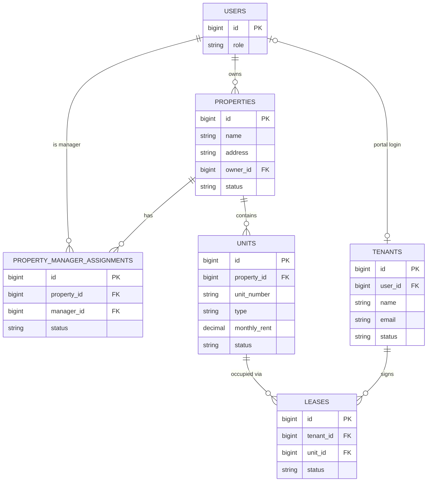

# Property / Unit / Tenant Schema Design

**Owner:** Kokebe — Properties, Units & Tenants
**Week 1, Day 1**
**Status:** Confirmed — decisions below approved by the team on Week 1, Day 1
**Sources:** MVP SRS v2.0 (§3.3 Data Requirements, §3.4 Business Rules), API Contract v2.0 (§11–13)

---

## 1. properties

| Field | Type | Rule | Source |
| --- | --- | --- | --- |
| id | bigint unsigned, PK | auto-increment | — |
| name | varchar(150) | required | Contract §11 |
| address | varchar(255) | required | Contract §11 |
| description | text | nullable | Contract §11 |
| owner_id | bigint unsigned, FK → users.id | required; user must hold `property_owner` role | FR-02.1, FR-02.3 |
| status | enum('active','archived') | default `active` | FR-02.6, BR-13 (archive, don't hard-delete) |
| created_at / updated_at | timestamp | — | — |
| deleted_at | timestamp, nullable | Laravel `SoftDeletes` trait — recovery safety net alongside `status` | Decision 1 below |

## 2. property_manager_assignments

| Field | Type | Rule | Source |
| --- | --- | --- | --- |
| id | bigint unsigned, PK | auto-increment | — |
| property_id | bigint unsigned, FK → properties.id | required | SRS §3.3 |
| manager_id | bigint unsigned, FK → users.id | required; user must hold `property_manager` role | FR-02.2, BR-03 |
| status | enum('active','inactive') | default `active` | SRS §3.3 (assignment status) |
| assigned_at | timestamp | required | SRS §3.3 |
| unassigned_at | timestamp, nullable | set when assignment is removed | SRS §3.3 |
| created_at / updated_at | timestamp | — | — |

## 3. units

| Field | Type | Rule | Source |
| --- | --- | --- | --- |
| id | bigint unsigned, PK | auto-increment | — |
| property_id | bigint unsigned, FK → properties.id | required, one property only | BR-01, FR-03.5 |
| unit_number | varchar(50) | required; unique **within** property_id | Contract §12 |
| floor | integer | required; >= 0 | Contract §12 |
| type | enum('studio','one_bedroom','two_bedroom','three_bedroom','other') | required | Contract §12 |
| monthly_rent | decimal(10,2) | required; >= 0 | Contract §12, FR-03.4 |
| currency | char(3) | default `ETB` | BR-07 |
| status | enum('vacant','occupied') | default `vacant` | FR-03.3, Contract §12 (minimum set) |
| created_at / updated_at | timestamp | — | — |

## 4. tenants

| Field | Type | Rule | Source |
| --- | --- | --- | --- |
| id | bigint unsigned, PK | auto-increment | — |
| user_id | bigint unsigned, FK → users.id, nullable | linked when tenant has portal login | SRS §3.3 (user reference where applicable) |
| name | varchar(150) | required, 2–150 chars | Contract §13 |
| email | varchar(255) | required, valid email, unique | Contract §13 |
| phone | varchar(20) | required; normalized to E.164, `+251` default country code | Contract §13, Decision 5 below |
| status | enum('active','inactive') | default `active` | Contract §13 |
| created_at / updated_at | timestamp | — | — |

**Design note:** `tenants` intentionally has no `unit_id`. Occupancy is derived through the Lease relationship (BR-05, BR-14) — Leases are the single source of truth for who occupies what, so we don't create a second field that can drift out of sync.

---

## Entity relationships

`LEASES` is included only so the Unit/Tenant relationship is legible — it belongs to Melu (Leases, Payments, Financials & Tenancy Cases) and is not built as part of this task.

---

## Confirmed decisions

1. **Property deletion**: `status` enum (`active`/`archived`) drives business logic and UI; Laravel `SoftDeletes` (`deleted_at`) added as a recovery safety net. Satisfies BR-13/FR-02.6.
2. **Tenant without login**: `tenants.user_id` is nullable. A Manager/Owner can create a Tenant record and attach a Lease before portal credentials exist; account provisioning is a separate flow owned by Beki.
3. **Unit status extension**: held at the approved minimum set — `vacant`/`occupied` only (FR-03.3, Contract §12). `maintenance`/`inactive` are not added for MVP; revisit only via a formal contract change per §28.
4. **Multiple active managers per property**: `property_manager_assignments` is many-to-many. Matches the Contract's `managers` array response and the add-one/remove-one endpoint shape.
5. **Tenant phone**: required, normalized to E.164 with `+251` as the default country code.

---

## Definition of Done for this task (per Task Division §8)

- [x] All 5 decisions resolved and recorded here
- [ ] Schema reviewed by Beki (Users/Auth dependency), Melu (Lease FK dependency), Tg (dashboard data dependency)
- [ ] Committed to `docs/schema/property-unit-tenant-schema.md` on `feature/property-unit-tenant-schema-design`
- [ ] MR opened, supervisor review requested
